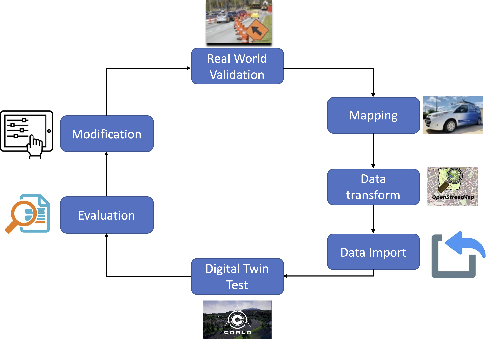
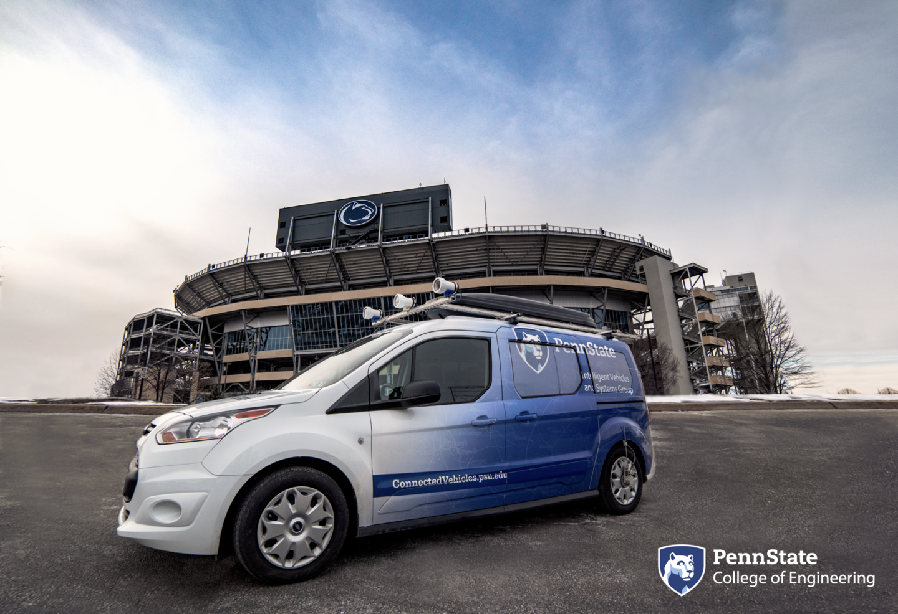

# Digital Twin 
By definition, a digital twin is a model which seeks to be a virtual copy of the real-world object, much as its name suggests. In the context of this project, an ideal digital twin is a self-updating database which ensures that an autonomous vehicle can have access to the current state of the environment and the areas around it. To do this, the database needs to satisfy two main requirements. First, the data must be precise enough for an autonomous vehicle to drive itself safely. Secondly, the data must be updated often enough that the vehicle can make real-time decisions. 

While in this work, the project was focused on its usage for autonomous vehicles, the technology being developed has a variety of uses and can be applied to just about any system or situation: a manufacturing plant, a shopping mall, or even a power grid.

Digital twins involve three primary aspects:

- Measuring data from the real world and then updating the digital twin correspondingly, for example, by pushing data into the database.
- Evolving data in the digital twin as consistent with reality, e.g. removing old data from the database as appropriate.
- Utilizing the data in the digital twin to make predictions, particularly for visualizations and virtual interactions such as simulations.

Example data for this digital twin information includes: A. The boundaries (e.g., what are the "borders" of the area in latitude, longitude, elevation - how do we define the perimeter?) B. The topology (e.g. what is the "surface" of the area? How do we define the mesh we are driving on?) C. The features within the area (lane markers, obstacles, images of the road surface, signs and other "decorators") D. Features external to the area that are far away, but affect the perception of reality (view of surrounding mountains, view of the sky, etc.) E. Actors within the digital twin (e.g. the vehicles, pedestrians, and traffic signals).

# Goal

Our goal is to develop the technologies to support a "digital twin" of physical systems such that experiments and analyses in one domain can allow analysis in the other domain. Among the simplest systems to study are roads: they have well-defined rules of operation (physics, traffic laws, etc.), a finite number of acting objects (the number of cars within a space are limited and small in number), small numbers of inputs (traffic signals, and a very few driver inputs to each car), and roads and vehicles have profound safety impacts to society. 

However, even in this simple case, many substantial challenges exist. Among these goals include: 

 1. Pulling & cleaning of complex heterogeneous data from multiple sensors. Within the road study, a vehicle must account for the variable speeds and location of other vehicles, the position of the road (through GPS), image data for traffic lights, elevation changes, etc.
 2. Finding minimum data solutions. Within the design of intelligent vehicles, as well as in many other fields, one of the most common problems is finding minimum data solutions, i.e. trying to maintain the effectiveness of systems while minimizing the amount of data sent. Within our case, both bandwidth and time are pressing concerns. Enabling high bandwidth is both costly and oftentimes unreasonable. And more pressingly, autonomous vehicles must be able to react quickly to sudden changes in road environments -- something which is less important in the simplest case, but quickly becomes crucial.
 3. Setting up additional devices for edge computing (IoT design). In order to help accommodate goal 2, these edge devices should be able to help ease some of the computational goals of the vehicle, such as locating itself in GPS coordinates, relaying road information, etc.

# Team members (work-in-progress)

 - Dr. Sean Brennan
 - Maddipatla Satya Prasad
 - Wushuang Bai
 - Liming Gao
 - Xinyu Cao
 - Julian Sim
 - Jack Csernica

# How it works
 

# Code repositories
[Digital Twin repository](https://github.com/ivsg-psu/Databases_Projects_DigitalTwin/wiki)

# Testing vehicle
- Penn State Mapping Vehicle
 

# Broader impacts
Digital twins have found much usage in many different disciplines, particularly those where materials are too expensive or complicated to reliably test with. For example, digital twins came about within NASA as a method to improve their abilities to test their spacecraft in simulations without putting too much risk to their equipment. While this work is currently aimed at simple use cases, this work can easily be expanded under these primary goals to handle more and more complicated vehicular systems. For example, handling road signs becomes a matter of adding stronger pictoral recognition and algorithms within the digital twin, enabling the algorithm to handle these more complicated systems. Yet with this added information comes additional bandwidth bloat, which reinforces the idea of minimal data solutions more.

# Groups with related interests
Please see links below for other research groups with related interests:
 
[Evaluation of Work Zone Safety Using SHRP2 Naturalistic Driving Study Data.](https://intrans.iastate.edu/research/in-progress/evaluation-of-work-zone-safety-using-shrp2-naturalistic-driving-study-data/)

# Digital Twin Applications
Digital twin technology can be applied on many aspects, including Immersive simulations, climate change, animal tracking etc.
[Augmenting air combat training.](https://www.asme.org/topics-resources/content/augmenting-air-combat-training)
 
[Climate change.](https://www.asme.org/topics-resources/content/a-digital-twin-for-mother-earth)
 
[A data visualization quantifies the stresses that boats put on blue whales.](https://www.americanscientist.org/article/giants-in-traffic)
 
[Remote sensing technologies allow researchers to track small changes on a large scale and enable studies of far-flung places from the comfort and safety of home.](https://www.americanscientist.org/article/the-shift-to-a-birds-eye-view)

# Funding
This project is funded by Pennsylvania Department of Transportation under NOFO # 693JJ319NF00001.
